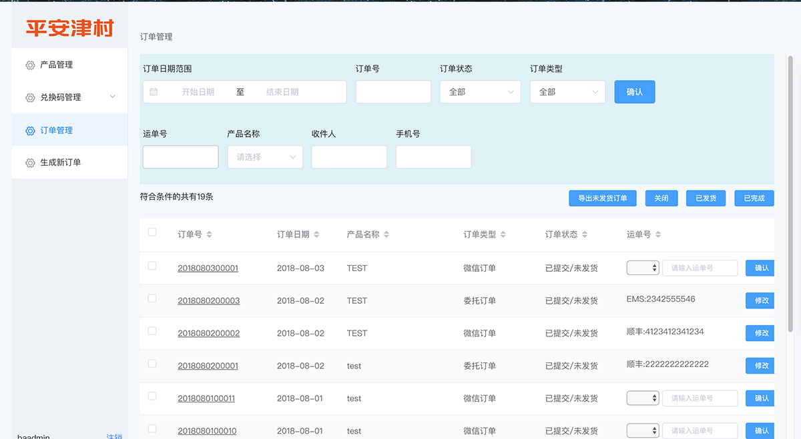
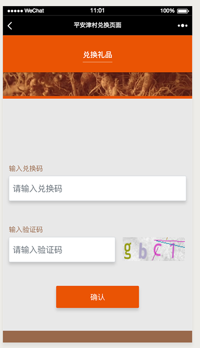
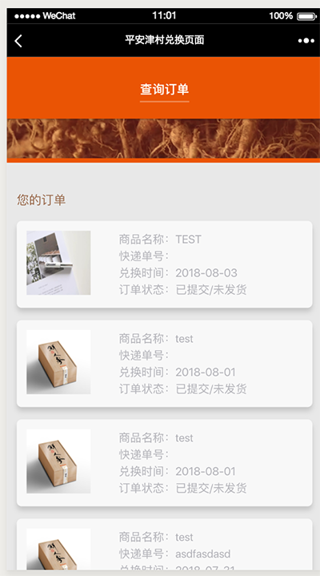

# 2018年-vue2 element-ui完成的简单的CRM系统
## 背景
一个营销商品推广管理平台，为平安津村（平安集团子公司）汉方药产品在移动端进行营销推广提供管理维护服务。
通过这个营销商品推广管理平台，平安津村的汉方药产品在移动端的营销推广将得到高效的管理和维护，从而提高销售业绩和客户满意度。
详细开发记录: https://my19940202.github.io/book/vue_project.html

## 功能分类
1. 产品管理：该功能用于管理平台内的产品信息。管理员可以设置产品名称、价格和规格等具体信息，并对产品进行新增、编辑和删除等操作。
2. 兑换码管理：在移动端营销活动中，兑换码是一种常见的促销方式。该功能用于管理每次活动所需的兑换码，包括兑换码的生成、兑换和注销等操作。管理员可以通过该功能批量生成兑换码，并监控兑换情况，以便及时调整活动策略。
3. 订单管理：该功能涵盖了订单生成的整个流程，包括订单的生成、确认、发货和收货等操作。管理员可以查看订单列表，对订单状态进行监控，确保订单的顺利处理。此外，订单管理还包括订单信息的编辑和删除等功能，方便管理员进行订单维护。
## 使用方法(建议使用node12预览)
1. webpack服务: npm run hot
2. 测试mock数据: npm run mock
3. 访问后端CRM: http://127.0.0.1:8080/#/order
4. 访问H5页面
    - 兑换页面 http://127.0.0.1:8080/#/code
    - 订单页面 http://127.0.0.1:8080/#/order

## 预览图

